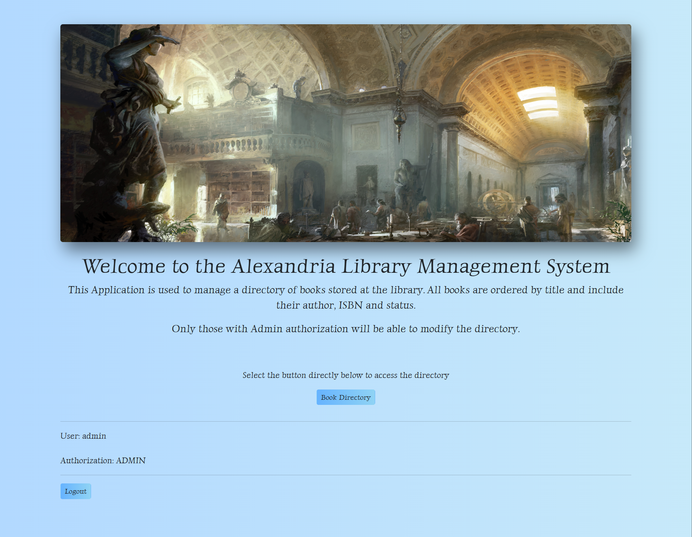
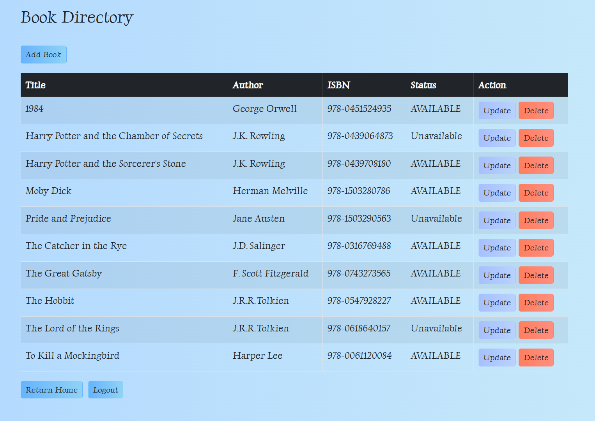
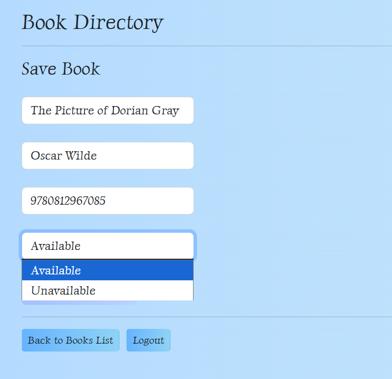
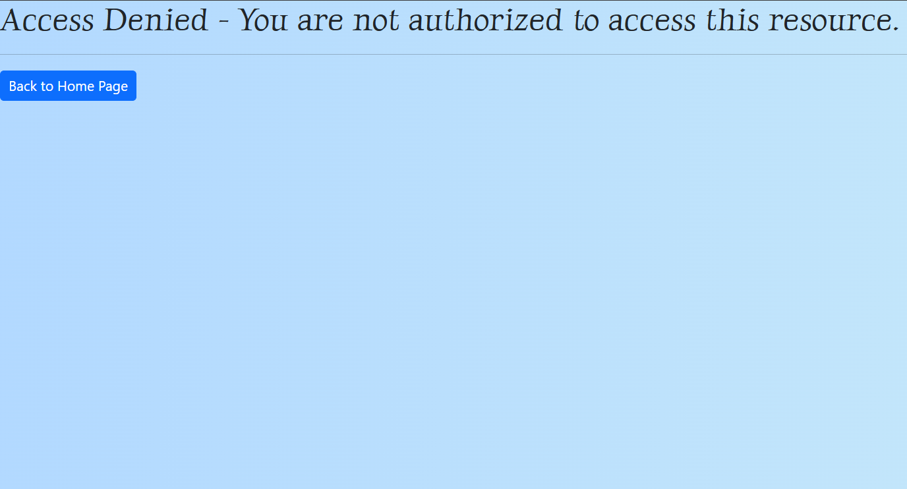

# 📚 Library Management System

> **A simple web-based library management system built with Java, Spring Boot, and Thymeleaf.**

---

<!-- Library Banner -->
<p align="center">
  
</p>

---

<p align="center">
  
  
  
  
  
  
</p>

---

## 📑 Table of Contents

1. [Introduction](#-introduction)
2. [Tech Stack](#-tech-stack)
3. [Features](#-features)
4. [Quick Start](#-quick-start)
5. [Screenshots](#-screenshots)
6. [Deployment](#-deployment)
7. [About](#-about)

---

## 🚀 Introduction

The Library Management System is a simple web application for managing books and their availability. Built with Java and Spring Boot, it offers a basic, user-friendly interface for library staff and patrons. This project is a learning exercise in backend development, security, and web design using the Spring ecosystem.

**Login Credentials:**
- Admin: `admin` / `adminpass`
- User: `user` / `userpass`

Use these credentials to sign in and explore the application's features based on roles.

---

## 🛠️ Tech Stack

- **Java 17** – Core programming language
- **Spring Boot 3.2.0** – Application framework
- **Spring Security** – Authentication and authorization
- **Spring Data JPA** – ORM and database access
- **Thymeleaf** – Server-side HTML templating
- **Bootstrap** – Responsive CSS framework
- **H2 Database** – Embedded, in-memory database
- **Maven** – Build and dependency management

---

## ✨ Features

- 📚 **Book Management:** Add, edit, delete, and list books
- 👤 **User Management:** Register, login, and manage users
- 🔒 **Secure Authentication:** Role-based access control
- 🖥️ **Modern UI:** Responsive and accessible design with Thymeleaf and Bootstrap
- 🗄️ **Embedded Database:** No external DB required (H2)

---

## 👌 Quick Start

1. **Clone the repository:**
   ```bash
   git clone https://github.com/Mikepin23/Library-Management-System.git
   cd Library-Management-System
   ```
2. **Build and run with Docker Compose:**
   ```bash
   docker compose up --build
   ```
3. **Access the app:**
   Open your browser and go to [http://localhost:8080](http://localhost:8080)

---

<!-- Screenshots: GitHub-safe layout using width/height attributes only -->

<p align="center">
  <span style="display:inline-block; text-align:center; margin:0 10px;">
    <b>Home Page</b><br/>
    
  </span>
  <span style="display:inline-block; text-align:center; margin:0 10px;">
    <b>Book Directory</b><br/>
    
  </span>
  <span style="display:inline-block; text-align:center; margin:0 10px;">
    <b>Add Book</b><br/>
    
  </span>
  <span style="display:inline-block; text-align:center; margin:0 10px;">
    <b>Access Denied</b><br/>
    
  </span>
</p>

---

## 🚢 Deployment

This project is live:

[🌐 Demo Now](https://library-management-system-4z5f.onrender.com)

> _Please note: The Render server may take a few minutes to start up if it has been idle._

---

## 👤 About

Created by **Michael Pinsonneault**

- [Portfolio](https://portfolio-michael-pinsonneault.onrender.com)
- [GitHub](https://github.com/Mikepin23)
- [LinkedIn](https://www.linkedin.com/in/michael-pinsonneault)

> Thank you for checking out my project!